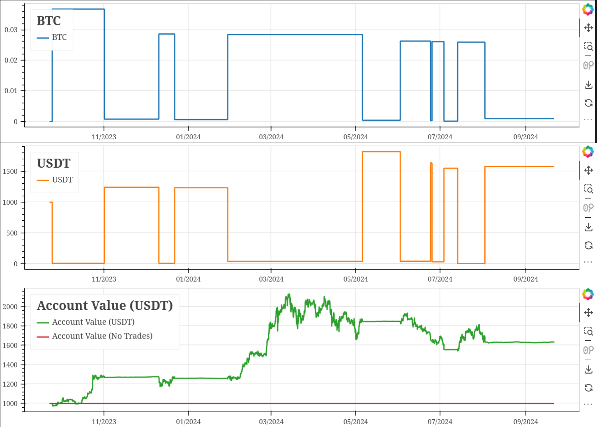

# QuantiPy

QuantiPy is a Python crypto and securities trading bot with various trading
patterns and strategies using Blankly as the backend.

Strategies are written using the Blankly Model API and then run on the command
line. In using Blankly, the strategies can easily be backtested before use.

These are my personal strategies and are ***categorically and unequivocally
unfit for use in real markets***. As the saying goes: "A fool and his money
are soon parted"

## Currently supported Strategies

- Stochastic RSI + RSI + MACD
- RSI Oversold

## Installation

To get started with QuantiPy, follow these steps:

### Prerequisites

- Python `3.9` or higher
- Poetry for dependency management
  - If you don't (or can't) have poetry installed, just use the
  `pyproject.toml` file and install all dependencies from the
  `[tool.poetry.dependencies]` section

### Setup

1. **Clone the repository:**

   ```bash
   git clone ...
   cd QuantiPy
   ```

2. **Install the dependencies:**

    ```bash
    poetry install
    ```

3. **Run a strategy backtest:**

    ```bash
    poetry run python run.py <strategy> <exchange> --symbol MSFT
    ```

    - By default `--live` is false to prevent accidental losses
    - Default starting cash for the backtest is:
        - ***$1000 USD*** if using regular securities through Alpaca
        - ***$1000 USDT*** if using crypto through Binance

## Usage

  Simple backtest of Bitcoin on Binance using the Stochastic + RSI + MACD strategy
  ```bash
  $ poetry run python run.py StochasticRSIWithRSIAndMACD Binance --symbol BTC-USDT --backtest
  ```

  Strategies are currently built with a "multi-symbol-single-position" sub-strategy

  I.e the strategy looks at multiple symbol price events but only takes up one active
  position at a time. This is intentional to avoid having to assign weights to
  different assets and make buy orders using the weights. Since they're treated as an
  "all or nothing" type of deal, it makes the state management much easier.

  However a sufficently motivated user could easily implement this weighting system and
  I may even try it in the future.

### Example strategy backtesting graph

Backtest of `StochasticRSIWithRSIAndMACD`


## Contributing

Contributions are welcome! Please read the contributing guidelines for more details.

## License

This project is licensed under the GNU General Public License v3.0 - see the
`LICENSE` file for details.

## Acknowledgments

Special thanks to the Blankly project for building the backend that makes these
strategies so simple to implement. It really takes the headache out of it!

## @ToDo:

- ~~Add simple conversion to screener via CLI switch~~
- Tests
- Add more strategies
- Much better logging and/or csv output
- Add stop loss and take profit handlers
- Improve open_position detection